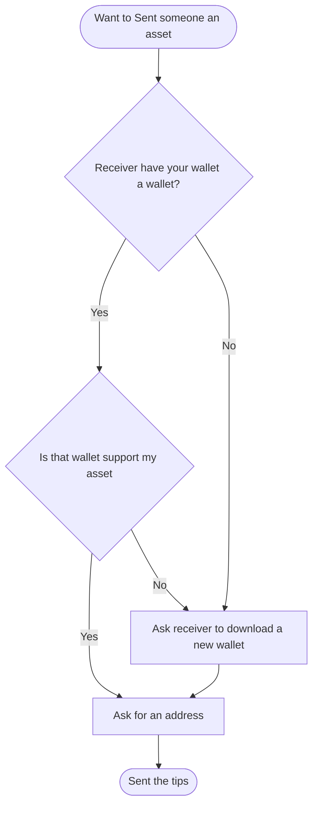

## Sender friction

```mermaid
flowchart TD
    A([Want to Sent someone an asset]) --> B{Receiver have your wallet a wallet?}
    B -- Yes --> B2{Is that wallet support my asset} -- Yes -->C[Ask for an address]
    B2 -- No --> E
    C --> D([Sent the tips])
    B -- No ----> E[Ask receiver to download a new wallet]
    E --> C
```
## Receiver frictions
