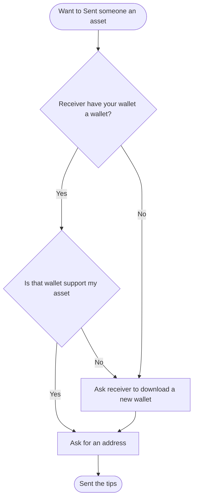

# Why do we need this
Senders have to interact with the Receiver many times and ask them to do a lot of things before they can receive tips or gifts. This leads to a bad first-time user experience. Even experienced crypto investors don't want to own many wallets and download wallet every time a new network appears.

By use Hyperlink.cash Sender and Receiver experience can be improved by delaying unnecessary steps like downloading a new wallet and learning how to use them. This can be exceptionally hard for crypto beginners or non tech-savvy user

## Sender friction

## Receiver frictions
Learning curve is high for blockchain beginner. For experience blockchain user it take a lot of time to familiarize with tool on different chain.
